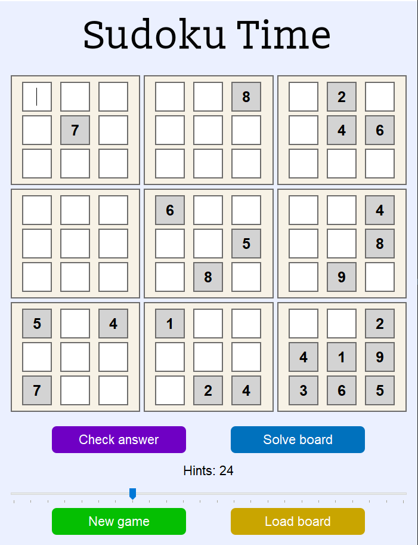

# 🧩 Sudoku Time

**Sudoku Time** is a desktop Sudoku app that lets you generate custom Sudoku boards with your preferred number of hints (pre-filled numbers).  
Solve the board yourself, check your answer, or let the app solve it automatically.  
You can even upload screenshots of Sudoku puzzles — like from *sudoku.com* — and solve them instantly.


## ✨ Features

- 🎲 **Generate Sudoku boards** with adjustable difficulty (choose the number of hints)
- ✍️ **Solve manually** and check your answer
- ⚡ **Automatically solve** any Sudoku board
- 🖼️ **Load and solve Sudoku puzzles from screenshots** (OCR-powered)
## 📥 Installation 

### 1️⃣ Clone the repository
```bash
git clone https://github.com/marcushoja0108/Sudoku
cd Sudoku
```
    
### 2️⃣ Install Python dependencies
Ensure you have at least **Python 3.8 or higher** installed
then pip install the required libraries:
```
pip install PyQt5 pytesseract opencv-python numpy
```

### 3️⃣ Install Tesseract OCR

The app uses **Tesseract OCR** to recognize numbers from images.  
You must install Tesseract **on your system**.

#### Windows

- Download the installer from https://github.com/tesseract-ocr/tesseract/wiki#windows  
- During installation, select the option to add Tesseract to your **system PATH**

#### macOS

```
brew install tesseract
```

#### Linux (Debian/Ubuntu)
```
sudo apt update
sudo apt install tesseract-ocr
```

### 4️⃣ Run the app

Run this file and you are good to go!
```
python main.py
```


## 🚀 Usage/Examples
### 🧩 Starting a Game

When you launch the app, it generates a Sudoku board with **24 pre-filled hints**.  
You can adjust the number of hints between **17** (minimum) and **40** (maximum) using the **Hint slider** before creating a new board.

### ✏️ Inputting Answers

Click on any white square to enter your answer.  
When finished, click **Check answer** to validate your board:

- **Correct answers** turn green.
- **Incorrect answers** turn red.

---

### 🕹️ Available Buttons

#### ✅ Check answer  
Validates your input against Sudoku rules and highlights correct and incorrect squares.

#### 🧩 Solve board  
Automatically solves the board:

- Fills each empty square with a valid number.
- Uses backtracking to handle conflicts.
- Continues until the board is solved.

#### 🎚️ Hint slider  
Select how many hints (pre-filled numbers) you want on a new board.  
⚠️ **Note**: Setting **35+ hints** may slow down board generation due to complex combinations.

#### 🔄 New game  
Generates a new board with your selected hint count.  
The program ensures the board is solvable before displaying it.

#### 🖼️ Load board  
Import a **screenshot of a Sudoku board** from your files.  
The app uses OCR (Optical Character Recognition) to detect numbers and fill them into the board.  
*(OCR accuracy during testing: ~91%)*

#### 🛠️ Confirm board  
Appears after loading a board via OCR.  
Lets you manually edit detected numbers (to correct OCR mistakes) before locking them as hints.
## 🧐 OCR Testing

This repository includes a dedicated testing environment to evaluate and improve the OCR (Optical Character Recognition) system used to read Sudoku boards from images.

### 🎯 Purpose
These tools allow users to:

* Understand the preprocessing steps applied to Sudoku board images before OCR.

* Evaluate the accuracy of OCR outputs on several test boards.

* Experiment with alternative preprocessing techniques or OCR configurations to potentially improve accuracy.

### 📂 Contents
* `ocr_test_tesseract.py` — Runs OCR on 6 predefined test board images and compares the output to the correct board values. The script prints the accuracy of the OCR for each board and the overall average accuracy.

* `scores.txt` — Contains recorded accuracy scores for different preprocessing combinations and test boards.

* Test board images — 6 images found in the `OCR_testing` folder.  These represent a variety of Sudoku board styles and qualities to benchmark OCR performance.

### ⚙️ How it works
The OCR testing script:

1. Loads a test board image.

2. Applies a series of preprocessing steps (grayscale conversion, blurring, adaptive thresholding, contrast enhancement, etc.).

3. Splits the image into cells and performs OCR using Tesseract configured to recognize only digits 1–9.

4. Compares the recognized board to the ground truth board and reports accuracy.

The script is modular, making it easy to:

* Modify or replace preprocessing steps.

* Add new test images and ground truth boards.

* Experiment with alternative OCR models (for example, K-Nearest Neighbors (KNN)-based digit recognition is also included as an alternative approach).